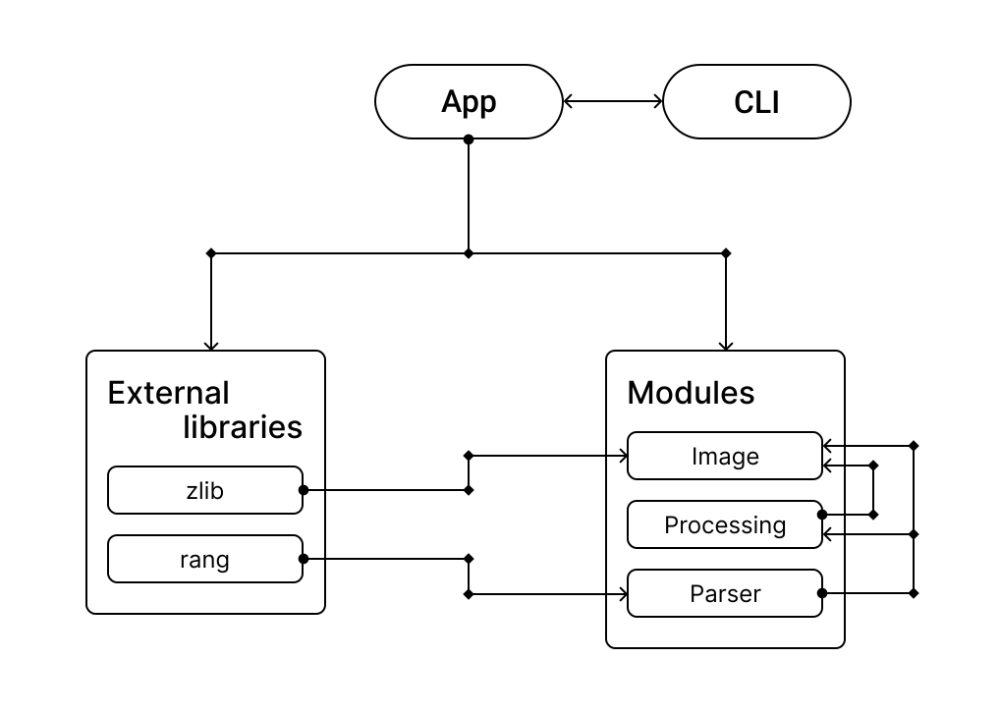

# GGPEG image editor

__ggpeg__ - это утилита командной строки, предназначенная для обработки изображений. Она поддерживает ряд команд,
которые призваны предоставить пользователю возможность изменять изображения, представленные в разных форматах с помощью
фильтров и операций форматирования, таких как, к примеру, поворот или отражение по осям. Как упоминалось ранее, 
программа может работать с двумя типами изображений - PPM (Portable Pixel Map) и PNG (Portable Network Graphics).

## Установка и компиляция

Для локальной компиляции необходимо удовлетворить зависимости программы, которые приведены в таблице ниже.

| название компонента | актуальная версия на момент тестирования | ссылка на репозиторий |
| :-----------------: | :--------------------------------------: | :-------------------: |
| Catch2              | v3.3.2                                   | [ссылка](https://github.com/catchorg/Catch2) |
| rang                | v3.2                                     | [ссылка](https://github.com/agauniyal/rang)  |
| zlib                | v1.2.13                                  | [ссылка](https://github.com/madler/zlib)     |

Установить компоненты можно различными способами. Рекомендуемый нами способ состоит в использовании 
[vcpkg](https://vcpkg.io/en/index.html) - пакетного менеджера для C++ с открытым исходным кодом. После установки
этого менеджера для загрузки компонентов достаточно использовать команду:

    vcpkg install rang catch2 zlib

Для использования __rang__ может потребоваться вручную создать пустой файл "rang-targets.cmake" в папке соответствующего
модуля.
Для компиляции следует использовать следующие команды из папки "build/" в корне проекта:

    cmake .. -DCMAKE_TOOLCHAIN_FILE="<path_to_vcpkg_toolchain>" -DCMAKE_BUILD_TYPE=Debug
    cmake --build .

После этого бинарный файл __ggpeg__ можно найти в той же папке.

## Поддерживаемые форматы изображений

__ggpeg__ поддерживаются два формата - PPM и PNG, со следующими ограничениями:

| формат изображения | ограничения |
| :----------------: | :---------: |
| PPM                | - только бинарный формат (P6)   - максимальное значение пикселя должно быть меньше 256                           |
| PNG                | - только 2 *color_type* (RGB) и глубина цвета 8 пикселей   - только стандартное расположение байт (no interlace) |

Также стоит отметить, что обработка больших изображений (1 Mb и больше) может занять существенное время.

## Поддерживаемые CLI опции

__ggpeg__ поддерживает 7 функций обработки, приведенные в таблице ниже.

| опция         | параметры         | назначение                                                                                                                                                                        |
| :-----------: | :---------------: | :-------------------------------------------------------------------------------------------------------------------------------------------------------------------------------: |
| rotate        | $\omega$          | вращение изображения на $\omega$ градусов, где $\omega$ принадлежит интервалу (-360; 360). В случае, если поворот требует создания новых пикселей, они заполняются черным цветом. |
| crop          | a, b, c, d        | обрезка изображения на a, b, c и d процентов с четырех сторон.                                                                                                                    |
| insert        | *image*, x, y   | встраивание другого изображения в исходное по координатам (x, y).                                                                                                                 |
| reflect (X)   | -                 | отражение изображения по оси X.                                                                                                                                                   |
| reflect (Y)   | -                 | отражение изображения по оси Y.                                                                                                                                                   |
| resize        | k                 | увеличение разрешения в k раз.                                                                                                                                                    |
| negative      | -                 | фильтр "негатив"                                                                                                                                                                  |   

## Структурная схема

